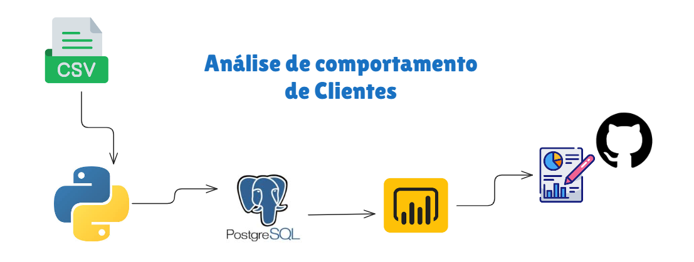
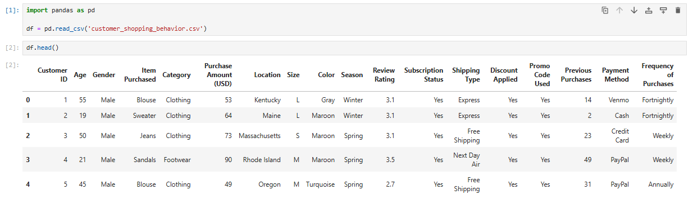
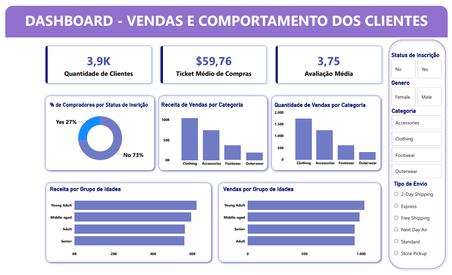

# **Comportamento de Vendas e Clientes**

> **Esse projeto analisa o comportamento de vendas dos clientes usando um DataSet que contém 3.900 compras de diferentes categorias de produtos. A principal finalidade é encontrar informações sobre padrões de gastos, segmentos de clientes, preferências de produtos e comportamento de assinatura para orientar decisões estratégicas de negócios, todas essas decisões serão tomadas através de métricas reais e analises comportamentais.**

### **O CSV foi alimentado com diferentes informações, como:**
- Dados demográficos do cliente (Idade, Sexo, Localização, Status da assinatura)
- Detalhes da compra (Item comprado, Categoria, Valor da compra, Estação do ano, Tamanho, Cor)
- Comportamento de compra (Desconto aplicado, Código promocional usado, Compras anteriores, Frequência de compras, Avaliação, Tipo de envio)

### Exportando esses dados, foi iniciado a análise utilizando python para a limpeza e transformação dos dados. 

### Algumas colunas foram modificadas para melhorar a setorização de informações com inumeros valores, como por exemplo, a idade. Para ser feito uma análise mais precisa, a coluna "idade" se transformou em "grupo_idade", para que assim conseguissemos ver como cada grupo etário se comporta.

### Após as transformações com Python, conectamos o script ao PostgreSQL, para que assim a nova tabela limpa e organizada pudesse ser utilizada para as analises.

### Algumas analises estruturais foram realizadas no PostgreSQL para responder algumas questões de negócio, como a comparação entre vendas para cada gênero, e as categorias de produtos mais vendidos.

### **Dashboard Power BI**

### Foi criado no Power BI um Dashboard interativo para apresentar de forma visual os Insights!

